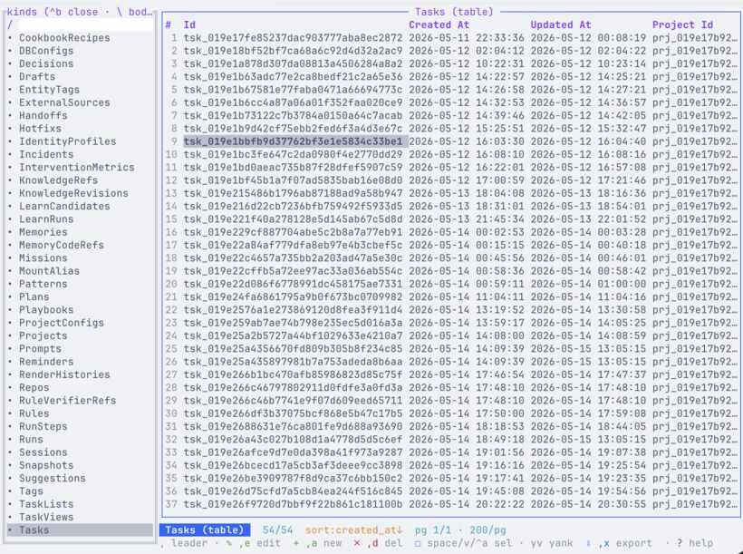
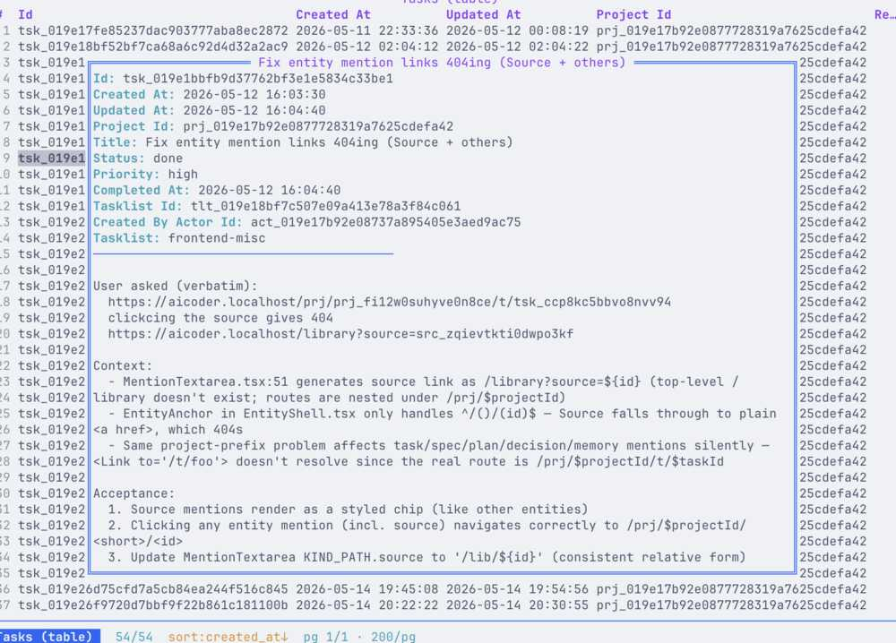
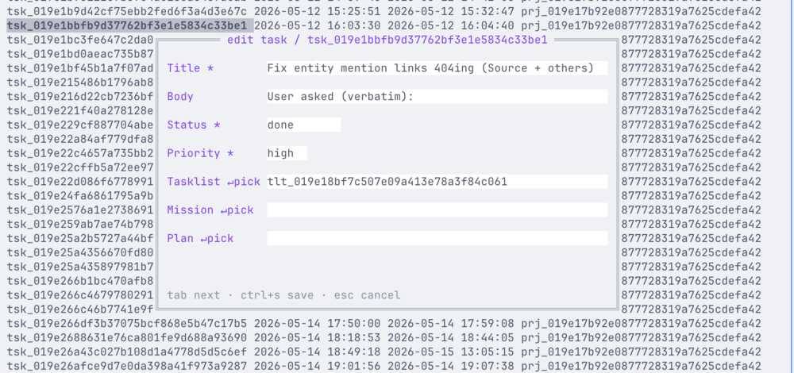
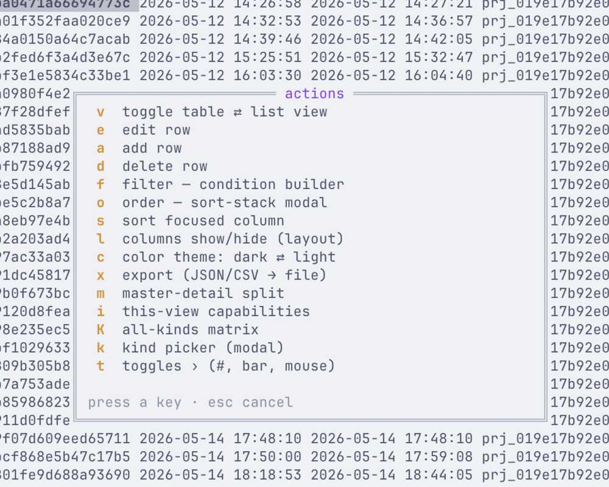
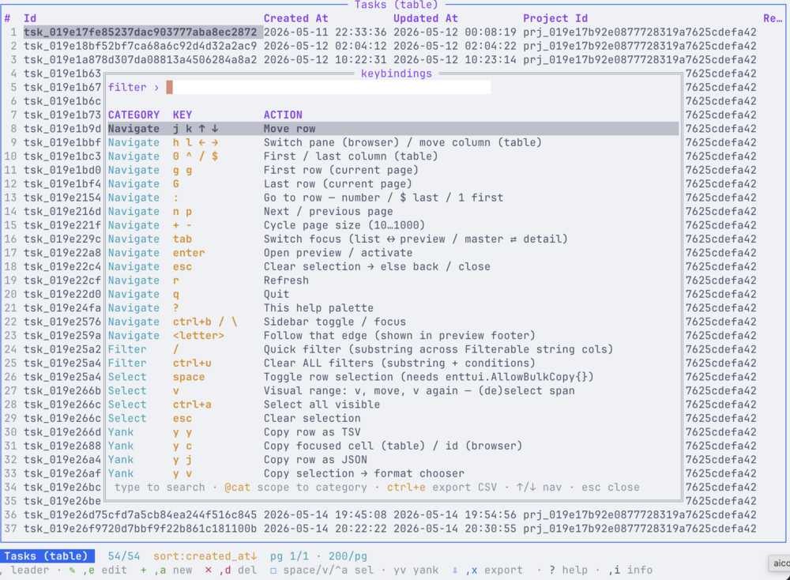

# lore

**Give your AI coding agent a memory.** lore captures what you and your agent
learn about a project — rules, decisions, patterns, gotchas, tasks — and turns
it into the `CLAUDE.md` / `AGENTS.md` your agent reads every session. So it
stops forgetting context and stops repeating the same mistakes.

One command to install, nothing to run, everything stays on your machine.
Ships with a Claude Code skill so the agent saves and recalls knowledge for you
automatically.

- [Install](#install)
  - [Install the skill (required)](#install-the-skill-do-this-now--required)
- [Quick start](#quick-start)
- [Concepts](#concepts)
- [Command reference](#command-reference)
  - [Project setup & ops](#project-setup--ops)
  - [Capture knowledge](#capture-knowledge)
  - [Retrieve & render](#retrieve--render)
  - [Project management](#project-management)
  - [Agent loop & automation](#agent-loop--automation)
  - [Backup, health & recovery](#backup-health--recovery)
- [Common flags](#common-flags)
- [Interactive TUI](#interactive-tui)
- [Building from source / contributing](#building-from-source--contributing)

## Install

> **lore needs two pieces, both required:**
> 1. the **`lore` binary** (the actual CLI/engine), and
> 2. the **Claude skill** (teaches Claude Code *when/how* to call `lore`).
>
> The Homebrew and script installers below install **both**. If you install
> the binary manually, install the skill separately (see
> [Install the skill](#install-the-skill)). The skill without the binary does
> nothing; the binary without the skill works but Claude won't use it
> automatically.

### Homebrew (macOS / Linux)

```sh
brew install thesatellite-ai/tap/lore
```

### Script (macOS / Linux)

```sh
curl -sL https://raw.githubusercontent.com/thesatellite-ai/lore/main/install.sh | sh
```

### Windows (PowerShell)

```powershell
irm https://raw.githubusercontent.com/thesatellite-ai/lore/main/install.ps1 | iex
```

Or grab a tarball from
[Releases](https://github.com/thesatellite-ai/lore/releases) and put `lore` on
your `PATH` (the `skills/` folder in the archive is the skill bundle).

### Install the skill (do this now — required)

lore needs **both** the binary *and* the Claude skill. The skill teaches Claude
Code **when and how** to call `lore` (capture on corrections/decisions/"remember
this", retrieve before answering, keep `CLAUDE.md` current). Without it the
binary works but Claude won't use it automatically.

The Homebrew and `curl … | sh` / PowerShell installers **already install the
skill** to `~/.claude/skills/lore` — you're done, just **restart Claude Code**.

Installed the binary some other way? Add the skill with one of:

```sh
npx skills add thesatellite-ai/lore          # via skills.sh
```

```sh
mkdir -p ~/.claude/skills/lore               # manual: from a tarball/checkout
cp -R skills/. ~/.claude/skills/lore/
```

Then **restart Claude Code** so it loads.

## Quick start

```sh
cd your-project

lore init                # create the local lore project
lore setup               # build the search index
lore directive install   # add the agent-directive block to CLAUDE.md / AGENTS.md

# capture knowledge
lore memory add --body="use Tailwind v4, not v3"
lore rule add --body="never force-push main"
lore decision add --title="Bundler" --body="Vite over Webpack: faster dev server"

# retrieve it
lore search "tailwind"            # search across all knowledge
lore render                      # (re)write CLAUDE.md from stored knowledge

lore tui                         # browse everything interactively
```

## Concepts

- **Project** — a local database under `.lore/` per repo (created by `lore init`).
- **Entities** — typed knowledge records: `memory`, `rule`, `decision`,
  `pattern`, `hotfix`, `snapshot`, `playbook`, `prompt`, `task`, `mission`,
  `plan`, `reminder`, `handoff`, `incident`, `techdoc`, and more.
- **Scope** — knowledge is scoped to the whole project (`master`) or a specific
  `--repo`. `add` persists `repo_id`; `list` and `search` filter by it with
  identical semantics (`--repo`, `--all-repos`, `--master-only`, `--no-inherit`).
  Real per-repo scoping — no body prefix-tag convention needed.
  Note: `edit --repo` does **not** re-scope (it's context-only, a known
  limitation) — re-scope via `add --supersedes=<old_id> --repo=<mount>`.
- **Render** — `lore render` compiles the relevant scoped knowledge into
  `CLAUDE.md` (or `AGENTS.md` / `.cursorrules` via `--target`).

### The common verb pattern

Almost every entity supports the same sub-verbs, so once you know one you know
them all:

```sh
lore <entity> add      --body="…"      # create (some take --title too)
lore <entity> list                     # list active rows
lore <entity> show     <id>            # full detail
lore <entity> edit     <id> --body="…" # update only the fields you pass
lore <entity> search   "query"         # search within that entity
lore <entity> archive  <id>            # soft-delete (reversible: unarchive)
lore <entity> delete   <id>            # HARD delete (no undo — prefer archive)
```

Bodies can be passed with `--body="…"` or piped: `echo "text" | lore memory add`.

## Command reference

`lore --help` lists everything; `lore <command> --help` shows every flag for
that command. Grouped by what you're trying to do:

### Project setup & ops

| Command | Use case |
|---|---|
| `lore init [path]` | Create a new project (`.lore/lore.db`, schema, gitignore, Project row). `--name`, `--non-interactive` |
| `lore setup` | One-time post-install/upgrade migrations (builds the search index). Run once per project after install/upgrade |
| `lore directive install` | Inject the lore agent-directive block into `CLAUDE.md` / `AGENTS.md` so agents know to use lore (`remove` to undo) |
| `lore identity` | Manage the persisted human/agent identity at `~/.lore/identity.toml` |
| `lore config` | Get/set DB-level config keys (`dbconfig` table) |
| `lore version` | Version, schema version, build info (`--json`) |
| `lore doctor` | Health checks; exit 0 healthy / 1 degraded / 2 broken |

### Capture knowledge

| Command | Use case |
|---|---|
| `lore memory add` | Free-form learned knowledge ("use X not Y"). `--kind core\|retrieved\|episodic\|procedural\|archival` |
| `lore rule add` | Hard constraints the agent must follow ("never force-push main") |
| `lore decision add` | Architectural decision records (title + rationale) |
| `lore pattern add` | Reusable code/design patterns |
| `lore hotfix add` | Loud recurring warnings surfaced prominently in rendered context |
| `lore playbook add` | Step-by-step procedures ("how we cut a release") |
| `lore prompt add` | Saved prompt templates |
| `lore snapshot add` | Point-in-time knowledge capture |
| `lore handoff add` | Session/agent handoff notes |
| `lore incident add` | Incident records / postmortems |
| `lore techdoc add` | References to external documentation |
| `lore comment` | Attach comments to any entity |
| `lore tag` | Create tags and bind them to entities |

All of the above support `list / show / edit / search / archive / unarchive`
(see [the common verb pattern](#the-common-verb-pattern)). Use
`lore <entity> add --supersedes <id>` for an audited body change.

### Retrieve & render

| Command | Use case |
|---|---|
| `lore search "<query>"` | **The retrieval hammer** — one search across every entity, best-first ranked. `--limit`, `--all-repos`, `--json`, `--include-archived` |
| `lore <entity> search "<q>"` | Scope search to a single entity type |
| `lore search status` | Per-entity search-index counts + health |
| `lore search rebuild` | Rebuild the search index from source rows |
| `lore render` | Compile scoped knowledge → `CLAUDE.md`. `--dry-run`, `--target AGENTS.md`, `--repo`, `--project` |
| `lore why-context` | Show the last rendered context (exactly what the agent saw) |
| `lore commit-show <sha>` | Show every entity linked to a git commit |

### Project management

| Command | Use case |
|---|---|
| `lore project` | Manage projects (the top-level container) |
| `lore repo` | Manage repos within a project (per-repo scoping) |
| `lore task` | Discrete work items: `add / list / triage / someday / deferred / show / edit / start / done / cancel / search`. Two axes beyond `status`: `commitment` (`accepted`/`proposed`/`someday` — agents must set it on `add`, no default) and `deferred_until` (snooze; auto-resurfaces). Default views show only committed, active, non-deferred tasks. |
| `lore tasklist` / `lore task-view` | Group tasks; saved task-list filter views |
| `lore mission` | Containers that group related tasks |
| `lore plan` | Plans |
| `lore reminder` | Time-based reminders |
| `lore workflow` / `lore workspace` | Workflow and workspace records |

### Agent loop & automation

| Command | Use case |
|---|---|
| `lore run` | Log + inspect agent runs: `start / step / end / cancel / replay / show / list` |
| `lore link <sha> <entity> <id>` | Link a git commit to any entity (task/run/mission/decision/…) |
| `lore learn-from <source>` | Bootstrap knowledge from existing markdown/docs |
| `lore learn` | Manage background-learning staging (`learn_candidates`) |
| `lore directive` | Install/remove the agent-directive block |
| `lore skill` | Meta-tools for the Claude skill bundle (`compile`, `check`) |
| `lore session` / `lore querylog` | Inspect sessions and the query log |
| `lore actor` | Inspect actors (humans, agents, hooks, plugins) |
| `lore behaviour` / `lore suggestion` | Behaviours and suggestions |
| `lore pii-pattern` | Custom PII/secret detection patterns (capture refuses secrets by default) |
| `lore plugin` | Manage the trusted-plugin allowlist |

### Backup, health & recovery

| Command | Use case |
|---|---|
| `lore backup` | Online backup of the project DB |
| `lore restore <file>` | Restore the DB from a backup |
| `lore repair` | Recover from a corrupted DB |
| `lore doctor` | Health checks (DB integrity, FTS drift, schema version) |
| `lore support-bundle` | Produce a sanitized incident-report bundle |
| `lore snapshot` | Point-in-time knowledge captures (logical, not file backup) |

## Common flags

These work across most commands:

| Flag | Meaning |
|---|---|
| `--json` | Machine-readable JSON envelope (use this from scripts/agents) |
| `--repo <mount\|rep_id>` | Scope to one repo instead of project-master |
| `--project <id\|name>` | Operate on a specific project |
| `--db <path>` | Override the DB path (default: cwd's `.lore/lore.db`; also `LORE_DB`) |
| `--read-only` | Skip lock acquisition; refuse writes (safe for inspection) |
| `--include-archived` / `--archived` | Include soft-deleted rows |
| `--color auto\|always\|never` | Color output control |

Env: `LORE_DB`, `LORE_PROJECT_ID`, `LORE_REPO`, `LORE_HOME` mirror the flags.

## Interactive TUI

`lore tui` opens a full terminal UI to browse, filter, view, and edit every
entity in the DB — vim-style keys, fuzzy search, live theme toggle.



| | |
|---|---|
|  |  |
|  |  |

## Building from source / contributing

See **[docs/DEVELOPMENT.md](docs/DEVELOPMENT.md)** (build, release, Homebrew tap)
and **[CONTRIBUTING.md](CONTRIBUTING.md)**.
